<h1> Проект по тестированию сервиса электронных и аудиокниг "Литрес"</h1>

> <a target="_blank" href="https://www.litres.ru">Ссылка на сайт</a>

<h3> Список проверок, реализованных в автотестах:</h3>

### UI-тесты
- [x] Авторизация пользователя(успешная и неуспешная)
- [x] Поиск книги
- [x] Добавление книги в корзину
- [x] Удаление книги из корзины
- [x] Выход из аккаунта

----
### Проект реализован с использованием:
        

- Язык: `Python`
- Для написания UI-тестов используется фреймворк `Selene`, "обёртка" вокруг `Selenium WebDriver`
- Библиотека модульного тестирования: `PyTest`
- `Jenkins` выполняет удаленный запуск тестов.
- `Selenoid` запускает браузер с тестами в контейнерах `Docker` (и записывает видео)
- Фреймворк`Allure Report` собирает графический отчет о прохождении тестов
- После завершения тестов `Telegram Bot` отправляет в `Telegram` краткий вариант отчёта
- Полная статистика по прохождению тестов хранится в `Allure TestOps`
- Настроена интеграция `Allure TestOps` с `Jira`

----
### Удаленный запуск автотестов выполняется на сервере Jenkins
> <a target="_blank" href="https://jenkins.autotests.cloud/job/litres_autotest_project/">Ссылка на проект в Jenkins</a>

#### Параметры сборки

* `browser-version` - версия браузера (браузер `Chrome`)
* `comment` - комментарий

#### Для запуска автотестов в Jenkins

1. Открыть <a target="_blank" href="https://jenkins.autotests.cloud/job/litres_autotest_project/">проект</a>
2. Выбрать пункт `Build with Parameters`
3. Указать версию браузера
4. Указать комментарий
5. Нажать кнопку `Build`
6. Результат запуска сборки можно посмотреть в отчёте Allure

----
### Allure отчет

#### Общие результаты

#### Список тест кейсов
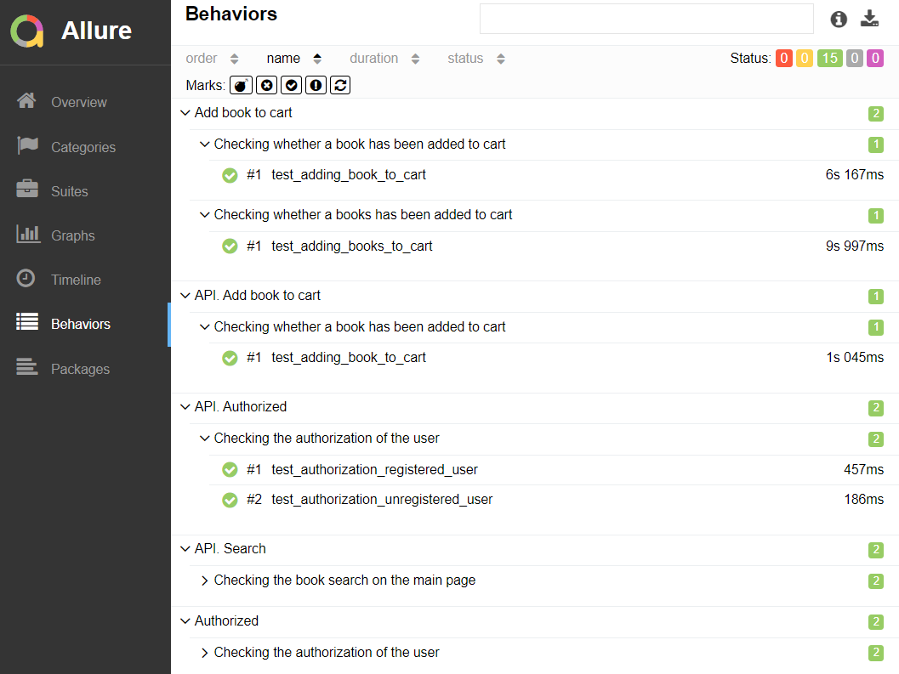
#### Пример отчета о прохождении ui-теста
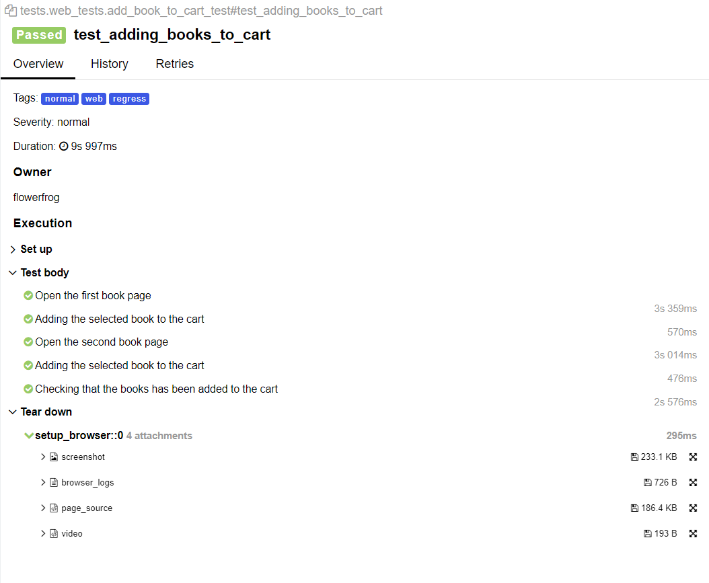
#### Пример отчета о прохождении api-теста
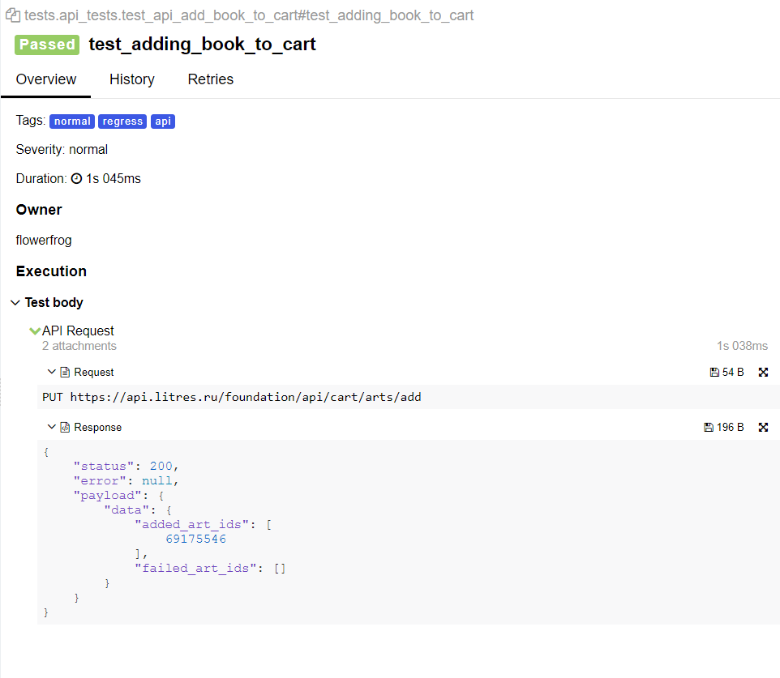
#### Пример отчета о прохождении mobile-теста
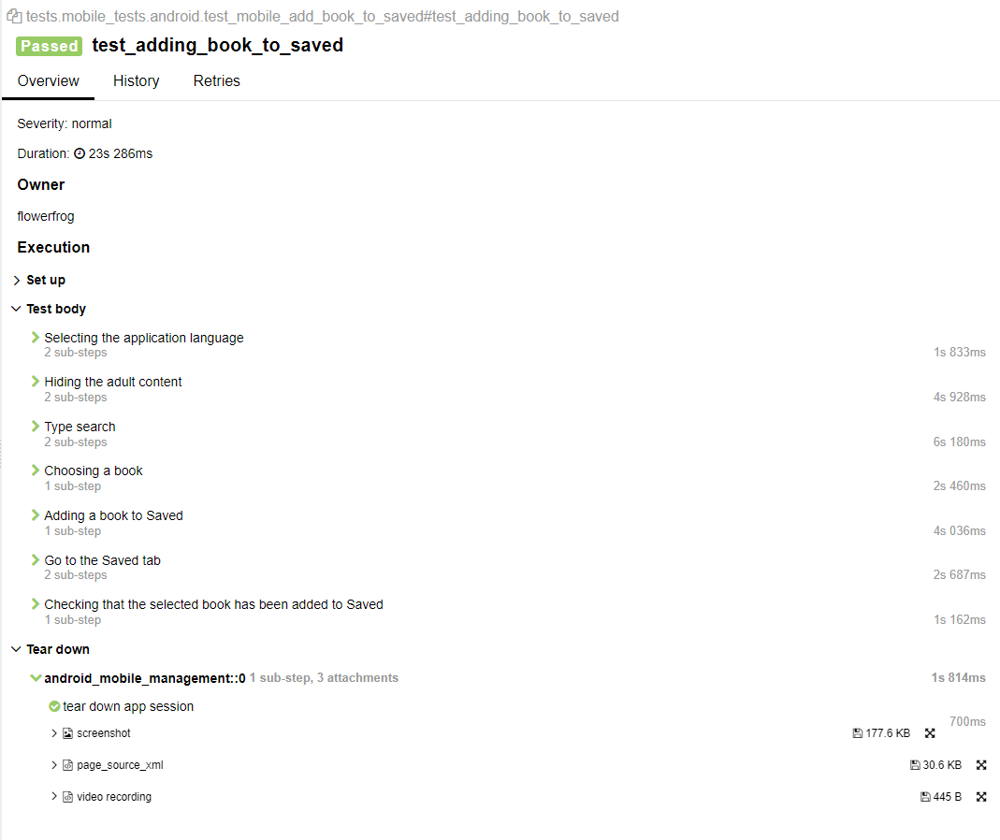

----
### Полная статистика по прохождению тестпланов, отчёты и приложения к ним хранятся в Allure TestOps
> <a target="_blank" href="https://allure.autotests.cloud/project/3942/dashboards">Ссылка на проект в AllureTestOps</a> (запрос доступа `admin@qa.guru`)

#### Тест-планы проекта
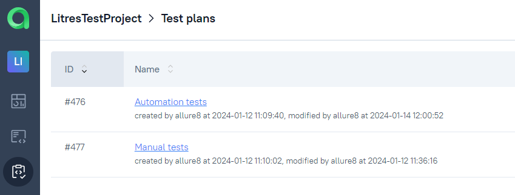

#### Общий список всех кейсов, имеющихся в системе (без разделения по тест-планам и виду выполнения тестирования)
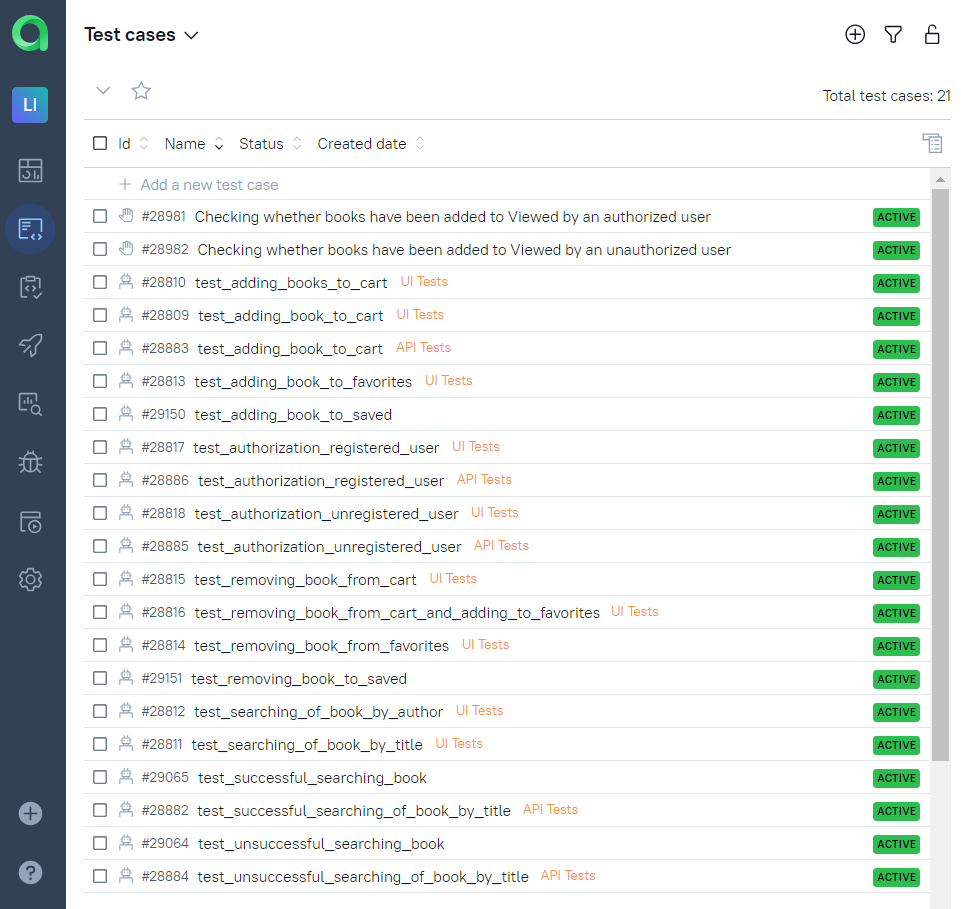

#### Пример отчёта выполнения одного из автотестов
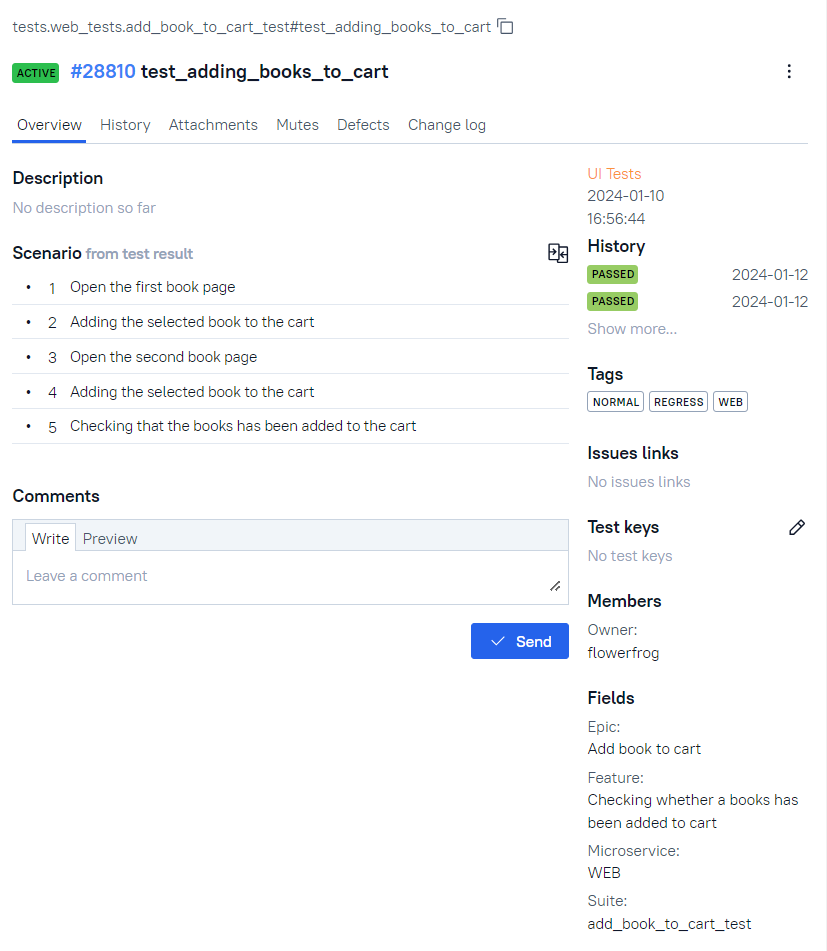

#### Тестовые артефакты
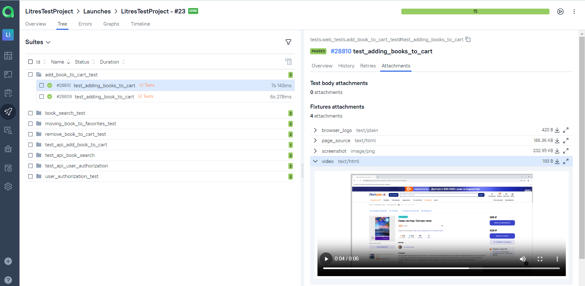

#### Пример dashboard с общими результатами тестирования
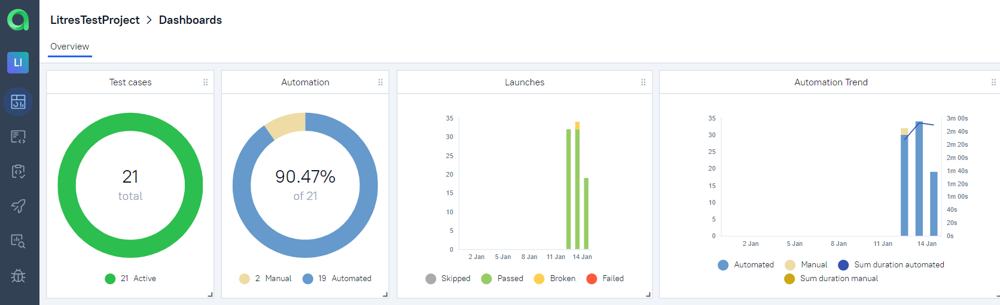

#### История запуска тестовых наборов
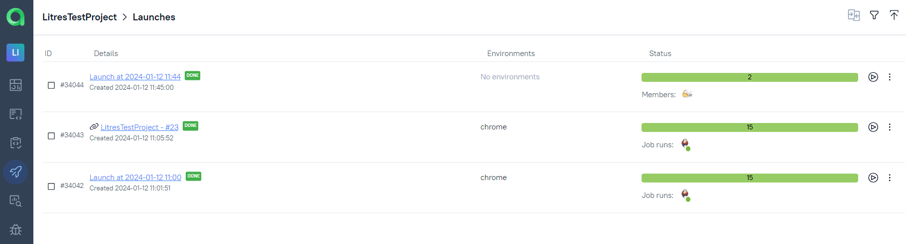

----
### Интеграция с Jira
> <a target="_blank" href="https://jira.autotests.cloud/browse/HOMEWORK-1045">Ссылка на проект в Jira</a>

----
### Оповещение о результатах прогона тестов в Telegram
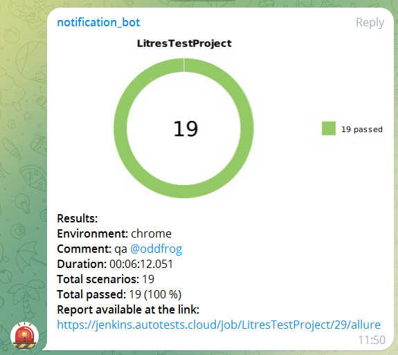

----
### Пример видео прохождения ui-автотеста

### Пример видео прохождения mobile-автотеста
