# Проект по тестированию сервиса электронных и аудиокниг "Литрес"

> [Ссылка на сайт](https://www.litres.ru)

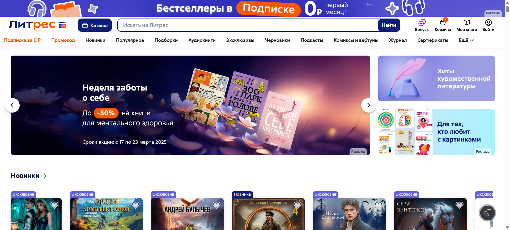

### Список проверок, реализованных в автотестах:

### UI-тесты
- [x] Авторизация пользователя(успешная и неуспешная)
- [x] Поиск книги
- [x] Добавление книги в корзину
- [x] Удаление книги из корзины
- [x] Выход из аккаунта

### API-тесты
- [x] Авторизация пользователя(успешная и неуспешная)
- [x] Поиск книги
- [x] Добавление книги в корзину
- [x] Проверка статуса корзины
- [x] Удаление книги из корзины
- [x] Добавление книги в Избранное
- [x] Удаление книги из Избранного

### Mobile-тесты
- [x] Поиск книги
- [x] Добавление книги в Избранное
- [x] Изменение языка интерфейса
----
### Проект реализован с использованием:
         

- Язык: `Python`
- Для написания UI-тестов используется фреймворк `Selene`, "обёртка" вокруг `Selenium WebDriver`
- Для написания Mobile-тестов используется `Appium`
- Библиотека модульного тестирования: `PyTest`
- `Jenkins` выполняет удаленный запуск тестов.
- `Selenoid` запускает браузер с тестами в контейнерах `Docker` (и записывает видео)
- Фреймворк`Allure Report` собирает графический отчет о прохождении тестов
- После завершения тестов `Telegram Bot` отправляет в `Telegram` краткий вариант отчёта
- Полная статистика по прохождению тестов хранится в `Allure TestOps`
- Настроена интеграция `Allure TestOps` с `Jira`

----
### Локальный запуск
> Перед запуском в корне проекта создать файл .env с содержимым:
```
SELENOID_LOGIN=user1
SELENOID_PASS=1234
SELENOID_URL=selenoid.autotests.cloud

EMAIL={email of your test litres account}
PASSWORD={password of your test litres account}

UNREGISTERED_EMAIL={any unregistered email on litres}
WRONG_PASSWORD=wrongpassword

bstack_userName={your browserstack username}
bstack_accessKey={your browserstack password}
app={link to apk in browserstack}
```

> Для локального запуска с дефолтными настройками необходимо выполнить:
```
poetry install --no-root
poetry env activate
poetry run pytest -s .
```
> Для web тестов можно задать версию браузера ("128.0" по умолчанию и "127.0""):
```
$env:browser_version="127.0"
poetry run pytest -s .
```
> Для mobile тестов можно выбрать, где прогнать тесты ("bstack" - browserstack (по умолчанию) и "local_emulator"):
```
$env:context = "local_emulator" 
poetry run pytest -s .
```

----
### Удаленный запуск автотестов выполняется на сервере Jenkins
> [Ссылка на проект в Jenkins](https://jenkins.autotests.cloud/job/litres_autotest_project/)

#### Параметры сборки

- `MODULE` - Web, API или Mobile тесты. All - все
- `BROWSER_VERSION` - версия браузера (браузер `Chrome`) для Web тестов
- `COMMENT` - комментарий


#### Для запуска автотестов в Jenkins

1. Открыть [проект](https://jenkins.autotests.cloud/job/litres_autotest_project/)
2. Выбрать пункт `Build with Parameters`
3. Выбрать модуль (Web, API или Mobile тесты)
4. Указать версию браузера (только для Web тестов)
5. Указать комментарий
6. Нажать кнопку `Build`
7. Результат запуска сборки можно посмотреть в отчёте Allure

----
### Allure отчет


#### Общие результаты прохождения UI тестов
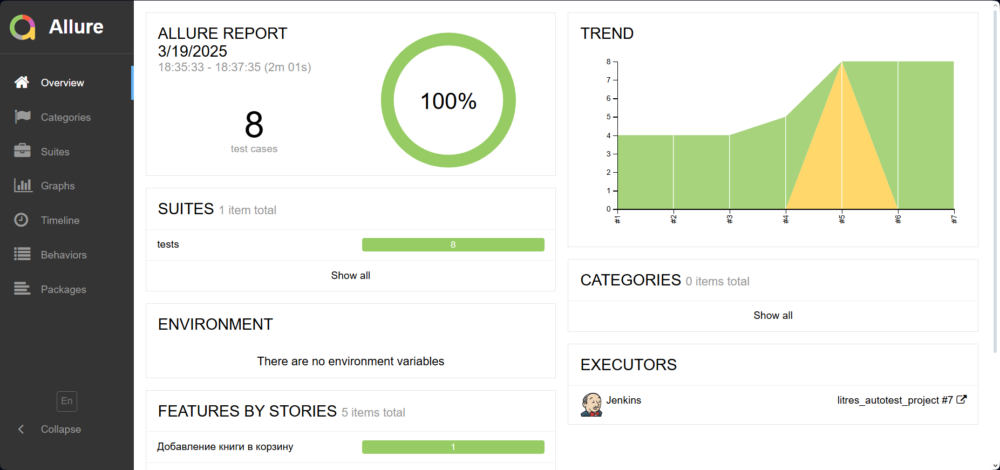
#### Список UI тест кейсов и пример отчета о прохождении теста
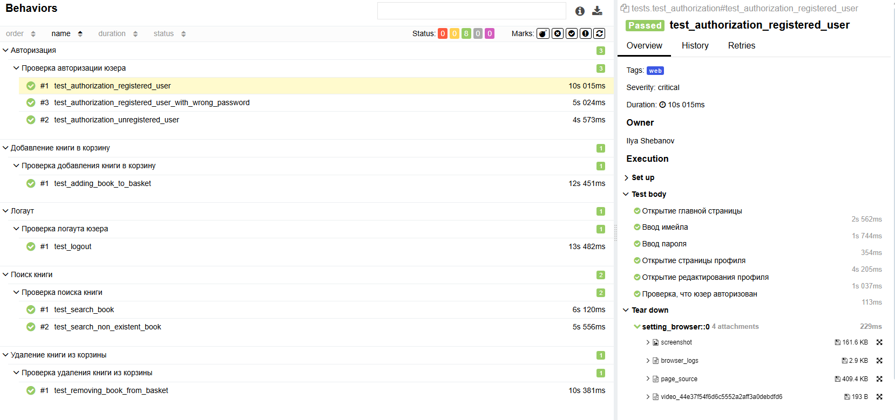

----
### Полная статистика хранится в Allure TestOps
> [Ссылка на проект в AllureTestOps](https://allure.autotests.cloud/project/4670/dashboards)

#### Дашборд с общими показателями тестовых прогонов

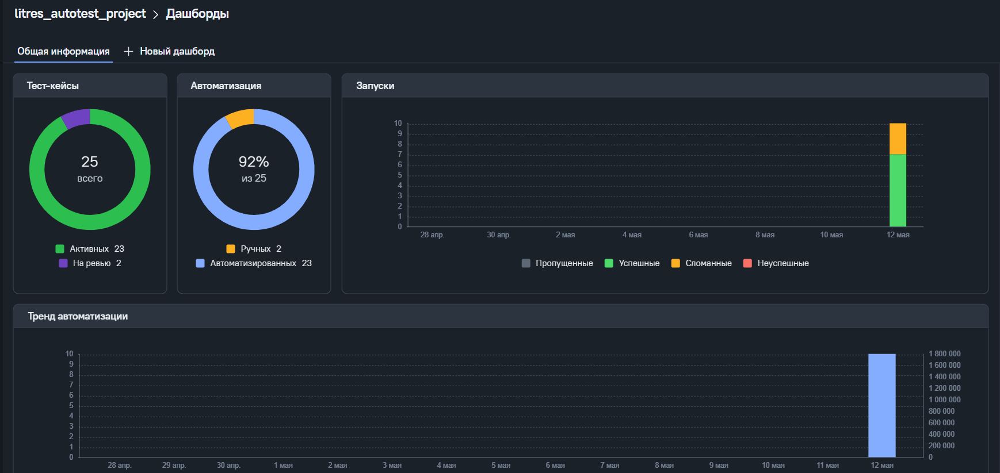

#### История запуска тестовых наборов

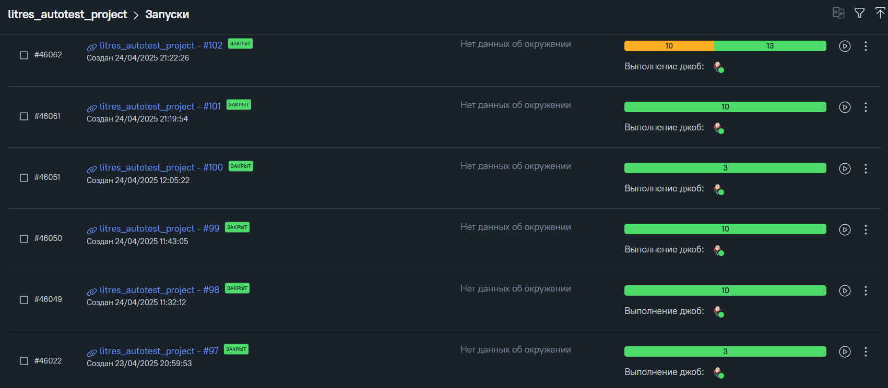

#### Фильтры для выбора модуля по тегу

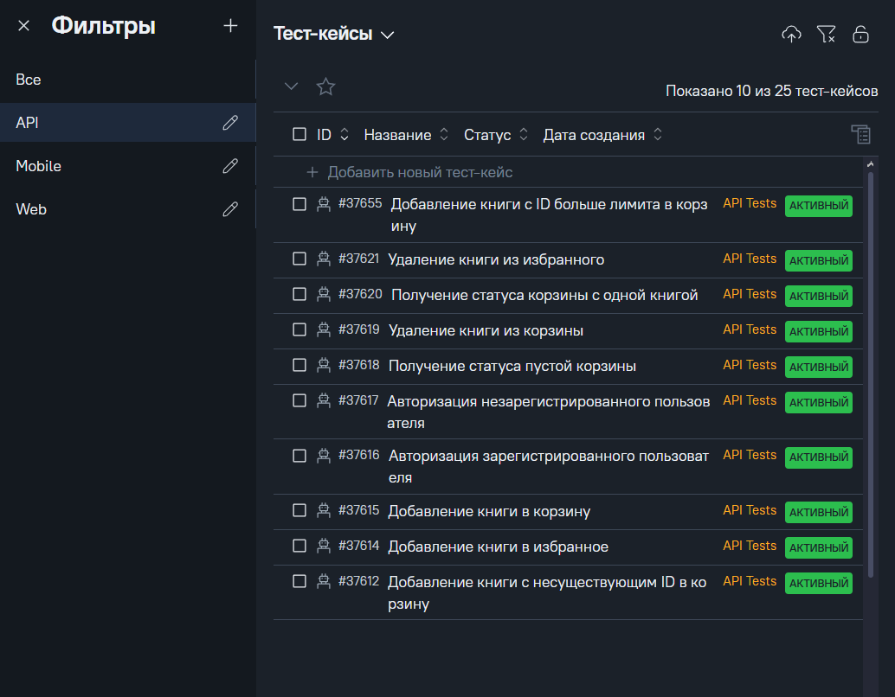

#### Пример тест кейса

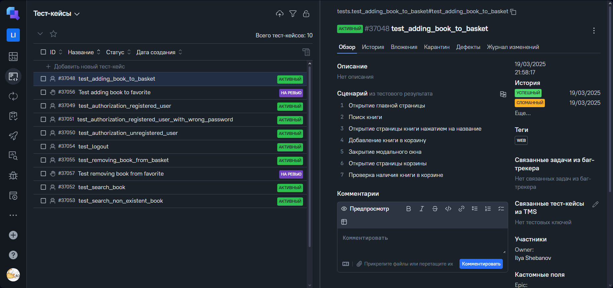

#### Тестовые артефакты

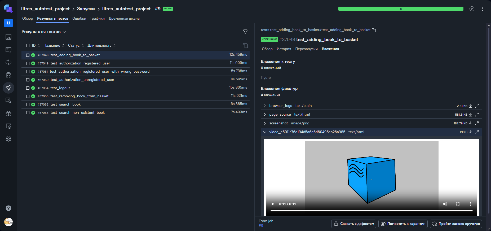

----

### Интеграция с Jira

> [Ссылка на проект в Jira](https://jira.autotests.cloud/browse/HOMEWORK-1421)

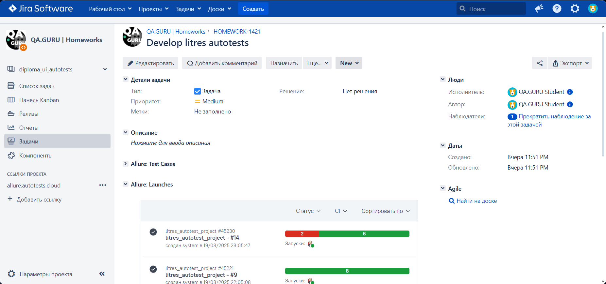

----
### Оповещение о результатах прогона тестов в Telegram
> [Ссылка на канал в Telegram](https://t.me/litres_autotest)

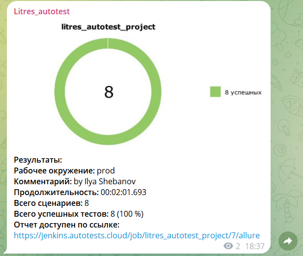

----
### Пример видео прохождения ui-автотеста


----

### Пример видео прохождения mobile-автотеста
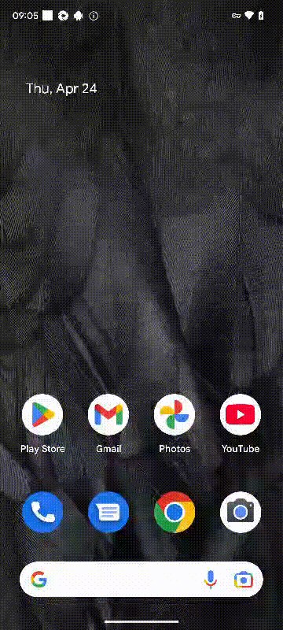